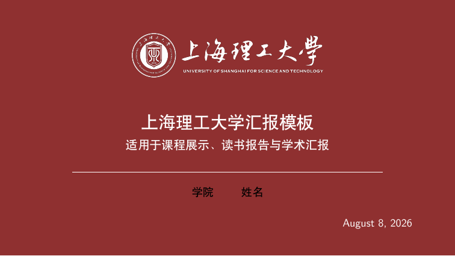

# USST Beamer Template

一套非官方的上海理工大学 LaTeX Beamer 模板，适合课程汇报、读书报告、组会展示、开题答辩和科研报告。



> 本项目由个人整理维护，不代表上海理工大学官方发布。校徽和校名图形属于学校品牌资产，使用前请阅读 [`NOTICE.md`](NOTICE.md)。

## 特点

- 保留上海理工大学红白主视觉风格。
- `Outline` 页自动编号，编号使用实心圆，章节标题加粗。
- 提供标题页、目录页、普通内容页和致谢页的统一样式。
- 提供可直接编译的示例文件和 PDF 预览。

## 文件结构

- `beamerthemeUSST.sty`：主题样式文件
- `template.tex`：开箱即用的示例模板
- `assets/usst_logo_red.png`：页眉 logo
- `assets/usst_logo_white.png`：封面与致谢页 logo
- `assets/source/usst-emblem.jpg`：校徽原始素材
- `assets/source/usst-wordmark.png`：校名原始素材
- `assets/preview.png`：示例 PDF 首页预览
- `.gitignore`：常见 LaTeX 中间文件忽略规则
- `LICENSE`：代码、样式文件和文档的开源许可证
- `NOTICE.md`：品牌资产使用说明

## 使用方法

1. 安装 TeX Live 或 MacTeX，并确保 `xelatex` 和 `latexmk` 可用。
2. 克隆仓库并进入目录：

```bash
git clone https://github.com/usstxw/usst-beamer-template.git
cd usst-beamer-template
```

3. 编译示例：

```bash
latexmk -xelatex template.tex
```

4. 修改 `template.tex` 中的以下信息：

- `\title`
- `\subtitle`
- `\author`
- `\institute`
- `\date`

## 常用命令

- `\ussttitleframe`：生成封面页
- `\usstoutlineframe`：生成目录页
- `\usstthanksframe`：生成结束致谢页

## 占位内容

- 模板默认采用自然的示例内容，而不是生硬的逐项提示语。
- 封面字段保留了简洁占位词，例如“姓名”“学院 / 班级 / 单位”。
- 日期字段默认写成 `\date{\today}`，会在编译时自动使用当天日期。

## 自定义建议

- 新增章节时，使用 `\section{...}`，目录页会自动更新。
- 如果主 `.tex` 文件不在项目根目录，可以在 `\usetheme{USST}` 之后写：

```tex
\renewcommand{\usstlogopath}{../assets}
```

- 如果想换成自己的学院或实验室信息，只需要修改封面元数据，不需要改主题文件。

## Logo 与开源范围

代码、样式文件和文档按 MIT License 发布。`assets/` 中的校徽、校名和派生 logo 不自动纳入 MIT 授权；请在公开使用、再发布或商用前确认符合学校视觉规范和品牌使用要求。

## 许可证

代码、样式和文档使用 [MIT License](LICENSE)。品牌资产的额外限制见 [NOTICE.md](NOTICE.md)。
